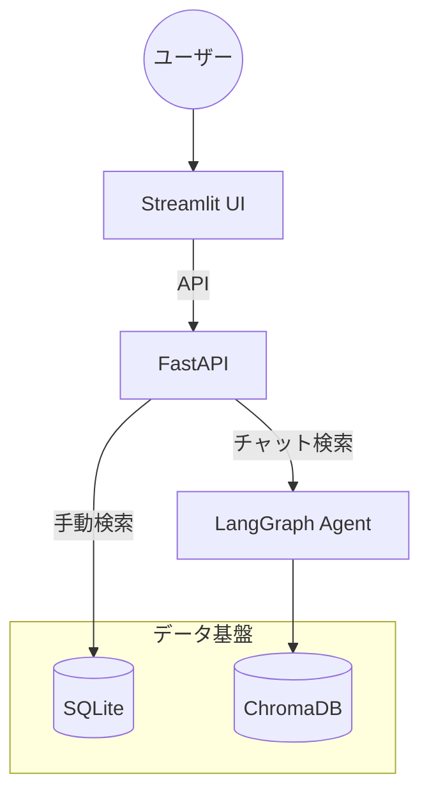
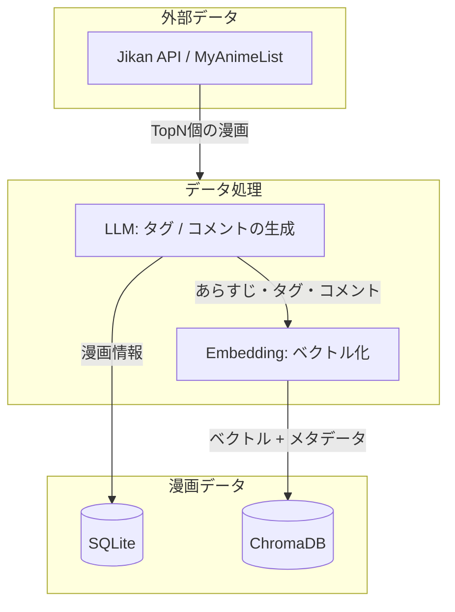
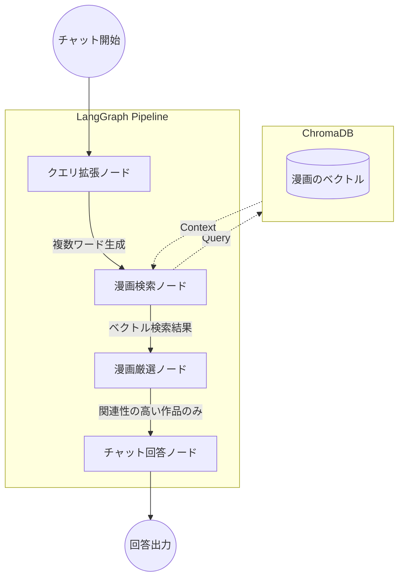

# Manga Library by AI
自分だけの読書記録をAIが拡張する、パーソナル漫画管理システム。

## 概要
「自分が読んだ漫画の感想を忘れがち」「友人におすすめを聞かれた時に即座に答えたい」という課題を解決するためのツールです。
単なるDB管理に留まらず、LLMエージェントが登録データを分析し、対話形式でのレコメンドや検索をサポートします。

## 主な機能
- **スマート管理:** 登録した漫画をカード形式で一覧表示。検索・編集をスムーズに行えます。
- **AIアシスタント:** LangGraphを用いたエージェントが、所持している漫画の中からユーザーの好みに合わせて提案します。
- **ハイブリッド検索:** キーワード検索に加え、AIによる「抽象的なニュアンス（例：泣ける熱いスポーツ漫画）」での検索が可能です。

## 技術スタック
| レイヤー                  | 利用したもの         | 選定理由・役割                 |
| :-------------------- | :------------- | :---------------------- |
| **Frontend**          | Streamlit      | 迅速なUI構築。                |
| **Backend**           | FastAPI        | 高速なAPI通信と非同期処理の実現。      |
| **RDB**               | SQLite         | 漫画の基本情報を持つベースのDB。       |
| **Vector DB**         | ChromaDB       | 抽象的な情報を管理するベクトルDB。      |
| **LLM**               | ローカル構築(Ollama) | プライバシー・トークン制限を考慮。       |
| **チャットモデル**           | Gemma 3:12b    | 安定して動く日本語対応のローカルLLM。    |
| **埋め込みモデル**           | embeddinggemma | 日本語対応のローカルEmbeddingモデル。 |
| **LLM Orchestration** | LangGraph      | AIによる検索・レコメンドフローの制御。    |

## 使い方
### セットアップ
#### 1. リポジトリのクローン
```bash
git clone
cd manga_libraly_by_ai
```
#### 2. 環境変数の設定
変更が必要な箇所のみ書き換えてください。
```bash
# .envファイルをコピー
cp .env.example .env

# .envファイルを作成して以下を設定
LLM_TYPE = ollama # ollama or openai

# --- Ollama Settings ---
OLLAMA_BASE_URL=http://host.docker.internal:11434 #ollamaを起動しているPCでdockerを立ち上げる場合
OLLAMA_MODEL=gemma3:12b
OLLAMA_EMBEDDING_MODEL=embeddinggemma

# --- OpenAI Settings ---
OPENAI_API_KEY=sk-xxxxxxxxxxxxxxxxxxxx
OPENAI_MODEL=gpt-4o-mini
OPENAI_EMBEDDING_MODEL=text-embedding-3-small

# --- Database Settings ---
SQLITE_URL=sqlite:///./app/data/manga.db
CHROMA_URL=./app/data/chroma
```
#### 3. Docker Composeを使用した起動
```bash
# すべてのサービスを起動
docker-compose up -d
```
#### 4.  アプリケーションへアクセス
- フロントエンド(**Streamlit**): http://localhost:8501
- バックエンド(**Swagger UI**): http://localhost:8000
#### 5. データの初期化
 1. Swagger UI:http://localhost:8000 にアクセス
 2. post/api/v1/manga/seed の「Try it out」ボタンを押す
 3. limitに初期作成するデータの数を入れる
 4. 「Excute」を押す
 5. 「Started seeding process for...」が返される
 6. バックグラウンドで下記の順番で処理が進むため暫く待つ
    1. Jikan APIからのデータ取得
    2. LLMによる翻訳・項目追加とSQLiteへの書き込み
    3. Embeddingによるベクトル化とChromaDBへの書き込み
 6. post/api/v1/manga/get_manga_countで登録済みの件数を確認可能

#### 注意事項
- データの初期化: 初期化にはそれなりに時間がかかります。(作者環境で約1.5時間/300件)
- LLMの消費トークン: 初期化時には漫画1つあたり、約45,000文字の日本語を入出力します。
- データの永続化: Dockerコンテナを削除してもデータが消えないよう、app/data フォルダはホスト側とボリュームマウントして管理しています。

## システム構成図
- **検索のハイブリッド化:** 
  明確な条件（タイトルやタグ）での検索には **SQLite** を使用し、ユーザーの曖昧な意図や「雰囲気」での検索には **ChromaDB（ベクトル検索）** を使用する、用途に応じた使い分けを実装しました。


## 漫画データ (Jikan API + LLM)
元となる漫画データはJIkan APIより取得します。更に、情報密度の高いベクトルDBを作成するため、あらすじ・ジャンル・テーマ・レビューを元に、以下の二項目をAIによって生成します。
- **ai_tag:** その漫画を表すジャンルなどを内包する7〜15個の日本語のタグ。カンマ区切り。
- **ai_comment:** その漫画のおすすめポイントを400文字程度で簡潔にまとめたもの。


## エージェント設計（LangGraph）
LangGraphを用いることで、単純なRAG（検索して回答）ではなく、「クエリの多角化」や「情報の再精査（厳選）」というステップを明示的に分離し、推薦の質を高めています。現在は以下の4ノードによるパイプラインを構築しています。
1. **クエリ拡張:** ユーザーの意図を汲み取り、複数の検索用キーワードを生成。
2. **漫画検索:** ChromaDBから類似度の高い作品を抽出。
3. **漫画厳選:** 抽出結果がユーザーの要望に合致しているかLLMが再評価し、厳選。
4. **チャット回答:** 厳選されたデータを元に、自然な推奨文を生成。



## 今後の展望
- **マルチソース検索:** Tavilly APIなどを統合し、DB/API外の情報を取得できるようにする。
- **質問ノード:** エージェントがユーザーに逆質問を行うノードを追加し、精度の向上を図る。
- **自己評価ノード:** 最終チェックをするノードを追加し、ハルシネーションを防止する。
- **類似検索ノード:** 特定の漫画のベクトルをクエリとしたベクトル検索を行う。
- **ハイブリット検索パイプライン:** エージェントがSQLiteの検索も行う処理フローを作る。 

## 出展
本アプリケーションで使用している漫画データは、[Jikan API](https://jikan.moe/) を通じて [MyAnimeList](https://myanimelist.net/) より取得しています。
このプロジェクトは学習および個人利用を目的としており、取得したデータの著作権は各権利者に帰属します。
- **Data Provider:** [MyAnimeList.net](https://myanimelist.net/)
- **API Service:** [Jikan API](https://jikan.moe/) (Unofficial MyAnimeList API)

## 開発プロセス
本システムは、AI（Gemini）との対話、及びAIによるコーディングを通じてアジャイルに開発されました。